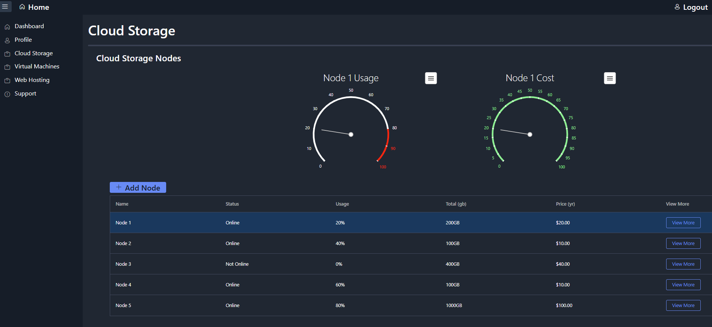

# MAMAPAI-Homepage

Devextreme 라이브러리를 사용하여 간단한 반응형 홈페이지 제작



### 배포 링크, 테스트 계정

- 배포 링크: [https://dx-cloud.vercel.app/](https://dx-cloud.vercel.app/)
- ID: [mp@email.com](mailto:demo.account@example.com)
- PW: pass

## **기술 스택**

### 프레임워크 및 라이브러리

- 
  
  
  

### 데이터베이스 및 계정 관리

- 

### HTTP 클라이언트 및 유틸리티

### UI 구성 요소

- 
- 

### 코드 품질 도구

- **ESLint**
- **Prettier**

### 디자인 및 프로토타입

### 프로젝트 및 이슈 관리

- **GitHub**

## 개발 환경설정

### **커밋 컨벤션**

- **feat**: 새로운 기능 추가
- **ui**: UI 요소, 스타일링, UX 개선 및 디자인 변경 사항
- **fix**: 버그 수정
- **perf**: 성능 개선
- **refactor**: 코드 리팩토링 (기능 변경 없음)
- **chore**: 빌드 설정, 패키지 관리, 기타 보조 작업
- **docs**: 문서 작업 (README, 주석 등)

### 브랜치 전략

### 코드 포매터 및 품질 관리

Prettier와 ESLint를 함께 사용하여 코드 스타일을 일관되게 유지하고 코드 품질을
관리했습니다. Prettier는 코드 포맷팅을 자동화하고, ESLint는 코드 품질 검사와
오류 방지를 담당했습니다. 특히, Airbnb 룰을 적용하여 엄격하고 일관된 코드
스타일을 유지함으로써 협업 시 코드 가독성과 품질을 높였습니다.

## **설치 및 실행 방법**

- git clone https://github.com/damoayo/DX-Cloud.git
- npm install
- npm run dev

### 로컬에서 실행하기 위한 필수 요구사항

- npm 또는 yarn

### 환경 변수 설정 방법: .env 파일 예시

루트 디렉토리에 `.env` 파일을 생성하고 아래와 같은 형식으로
환경 변수를 설정합니다:

```
NEXT_PUBLIC_API_SERVER_URL=
```

`.env` 파일은 보안 및 환경 차이로 인해 Git에 커밋되지 않도록 `gitignore`에
추가해두는 것이 좋습니다.

## **주요 기능**

### 간단한 홈페이지 제작

- Devextreme의 다양한 컴포넌트 사용 적용

### 검색

### 북마크

## **프로젝트 구조**

```bash
src/
├── assets/                       # 이미지, 폰트 및 아이콘 폴더
│   ├── img/                      # 일반 이미지 파일 저장
│   └── svg/                      # React 컴포넌트 형태의 SVG 아이콘 관리
│
├── components/
│       ├── ContactForm.tsx       # contact submit폼. ButtonItem,ButtonOptions외 다수의 devextreme 컴포넌트 사용.
│       ├── LoginForm.tsx         # 로그인 폼. 다수의 devextreme 컴포넌트 사용.
│       ├── ProductCard.tsx       # 카드형태 버튼. devextreme Button사용
│       │── Dashboard/
│       │    ├── CloudStoragePriceGauge.tsx     # CircularGauge등 다수의 devextreme 컴포넌트 사용.
│       │    ├── CloudStorageUsageGauge.tsx     # CircularGauge등 다수의 devextreme 컴포넌트 사용.
│       │    ├── TotalNodesChart.tsx            # PieChart등 다수의 devextreme 컴포넌트 사용.
│       │    └── VirtualMachinesGridDetail.tsx  # CircularGauge등 다수의 devextreme 컴포넌트 사용.
│       └── navbar/
│            ├── Navbar.css       # Text 크기조절
│            └── Navbar.tsx       # ToolbarTypes, Toolbar등 다수의 devextreme 컴포넌트 사용.
│
├── layouts/
│   ├── dashboard.css             # font,padding,margin
│   └── Dashboard.tsx             # Drawer, Toolbar등 다수의 devextreme 컴포넌트 사용.
│
├── pages/
│       ├── About.tsx             # About페이지 내용
│       ├── Contact.tsx           # Contact페이지
│       ├── Home.tsx              # Home페이지
│       ├── Login.tsx             # Login페이지
│       ├── Pricing.tsx           # Pricing페이지. Accordion등 다수의 devextreme 컴포넌트 사용.
│       ├── Products.tsx          # Products페이지. ProductCard, Navbar 컴포넌트 사용.
│       └── Dashboard/
│            ├── AddCloudStorage.tsx             # Cloud Storage페이지에서 Add Nodes에서 사용되는 컴포넌트.
│            ├── DashboardCloudStorage.tsx       # DataGrid, DataGridTypes외 다수의 devextreme 컴포넌트 사용.
│            ├── DashboardHome.tsx               # Dashboard Home페이지. TotalNodesChart등 devextreme 컴포넌트 사용.
│            ├── DashboardProfile.tsx            # SimpleItem, GroupItem외 다수의 devextreme 컴포넌트 사용.
│            ├── DashboardSupport.tsx            # TreeViewTypes, TreeView외 다수의 devextreme 컴포넌트 사용.
│            ├── DashboardVirtualMachines.tsx    # DataGrid, MasterDetail외 다수의 devextreme 컴포넌트 사용.
│            └── DashboardWebHosting.tsx         # Web Hosting 페이지 준비
│
├── App.tsx                       # 라우터 기능
│
├── index.css                     # tailwind 기본세팅
│
└── main.tsx                      # App 컴포넌트

```
